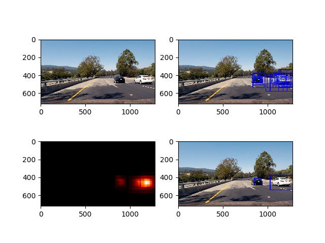

# Vehicle detection writeup

## Feature extraction
I used spatial binning, color histograms and HOG feature extraction to gain features
from the images. I played around with different color conversions to use for HOG extraction,
and in the end found that YCrCb's first layer (the luma) gives the best results. Initially I
used all three layers for the HOG transformation, but it adds too much computation time. The model's test
accuracy remains very high even when just using the first layer (98% plus accurate).
I used the Sandpit2.py file to play around with the parameters for the filters. Sandpit2.py creates
the plots and images, while the parameters get tuned in P5_project.py.

### Color histograms
The color histogram function (under features.py lines 12 to 17) extracts a color histogram
of the image in the RGB space. Initially I used 16 bins for the images, but after playing around I realized
I can decrease the number of bins to 6, without losing accuracy on my test set.

Below are three examples of what the color histogram looks like for images containing cars and images that don't.

### Spatial features
Next step is to extract spatial features, using the bin_spatial function in features.py, lines 7 tot 9. In essence this just bins the pixel values
for each image. Initially I used 32, but I lowered it down to 16 for the sake of computation time
(and negligible loss of accuracy for the test set of the model).

Below are three images of spatial binning.

### HOG features
The HOG features are the real heroes of the show. Spatial binning and color histograms are
like Alfred and Robin, while HOG features are Batman. In essence, HOG features gives a summary of the orientation
 is block of pixels, the function can be found in features.py, lines 20 to 36. In a way, it shows an aggregated direction of the edges. As mentioned
 above, I use the luma layer of YCrCb, and I take 30 pixels per block (up from 9 from the lecture).

A lower value for pixels per block gives a much clearer image of what's going on in the image. Below is an
image with a pixel per block value set to 2.

Intuitively this image would be much more useful for image extraction, but I found that increasing the pixels per
block to up to 30 increases the pipe's capability of finding windows. You can still see there's a difference between car and not-car
images in the three examples below.

So in the end I settled with 30 pixels per block, 2 cells per block and I only used the 1st layer of the YCrCb color translation.

Below are plots of the HOG features

## Modelling

I used the linear SVM classification model as a classifier. I tried using RandomForest and AdaBoost as well, but they give the same accuracy
 while taking too much processing time. I wanted to be fancy, but SVM proved to be the better choice :)

## Sliding window search
I set up three 'hot zones' for my sliding windows (see P5_project.py ine 12). The hot zones ignore the top half of the image (anything above the
 road in the image) and a bit of the image below (part of the driver's car). The hot zones only uses smaller windows for areas close to the middle -
 where the cars would appear smaller.

## The Pipeline
 The pipeline's process is as follows:

 1. Normalize[0,1] the image (since we trained the model using PNG files which as a range between 0 and 1)
 2. Get a list of all the windows (created by slide_window in the windows.py file)
 3. Test if each window contains a car
 4. If it contains a car, add 1 to the window's area on a blank image - this will create a heatmap
 5. Apply a threshold (I chose 4) to only show areas which are 'warm' enough
 6. Use the label function (from scipy) to find the areas where we can draw boxes)
 7. Draw boxes around these areas using draw_labeled_bboxes from P_5_project.py line 86)

Below are images showing the different steps, applied on the test images.

* Top left: original image
* Top right: hot boxes, where the SVM model classified the window as having a car in it
* Bottom left: Heatmap of the hotboxes
* Bottom right: Boxes drawn around the heat blops after the threshold was applied

This pipeline is applied to the project video in test_on_video.py.

Here's a link to the output video for this pipeline: [video](https://youtu.be/jEqmMY1mAzw)

## Discussion
The main challenge I faced was the abundance of false positives. For a while I tried increasing
the number of features for the classification model (which made things much slower), but after I tried a higher pixel per
cell value for the HOG filter I managed to lower it by quite a bit.

One way to fix this problem is to have track heat blops from frame to frame as well. This
can be done using a warmth layer, which takes the average of the past n heatmaps and use that to
find labels.

